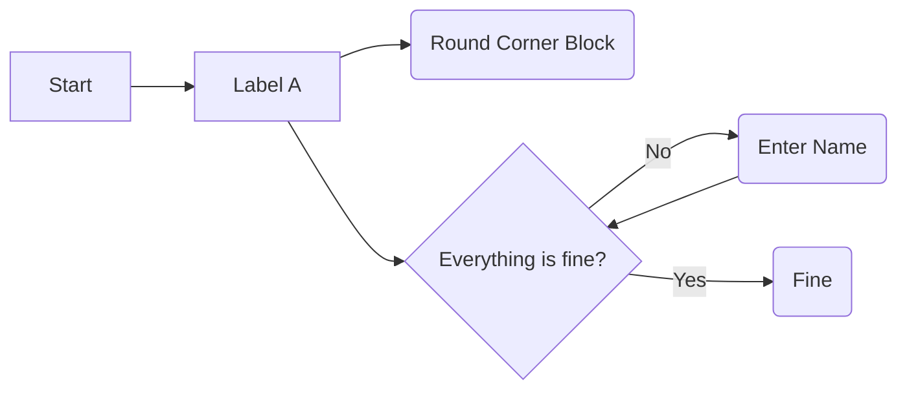
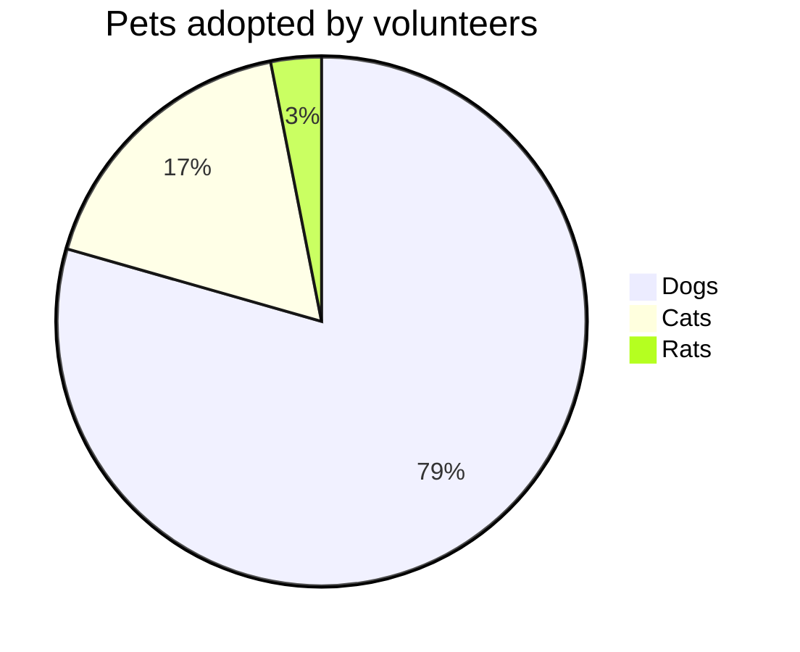
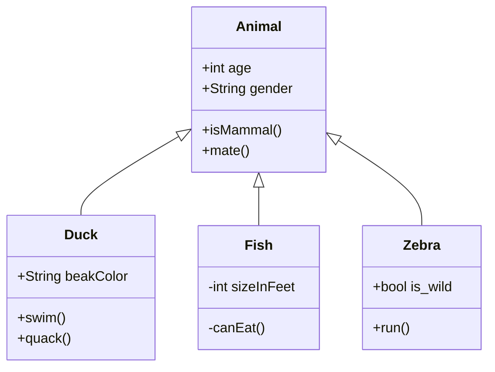

# Mermaid preview

[home]

Let's go
Edit diagrams on [mermaid.live](https://mermaid.live/) for further syntax examples

---

```mermaid
flowchart LR
    Start --> A[Label A]
    A --> B(Round Corner Block)
    A --> C{Everything is fine?}
    C -->|No| D(Enter Name)
    D --> C
    C -->|Yes| E(Fine)
```
---

```mermaid
pie title Pets adopted by volunteers
    "Dogs" : 386
    "Cats" : 85
    "Rats" : 15
```
---

```mermaid
classDiagram
    Animal <|-- Duck
    Animal <|-- Fish
    Animal <|-- Zebra
    Animal : +int age
    Animal : +String gender
    Animal: +isMammal()
    Animal: +mate()
    class Duck{
      +String beakColor
      +swim()
      +quack()
    }
    class Fish{
      -int sizeInFeet
      -canEat()
    }
    class Zebra{
      +bool is_wild
      +run()
    }
            
```
---
[home]

[home]:../README.md